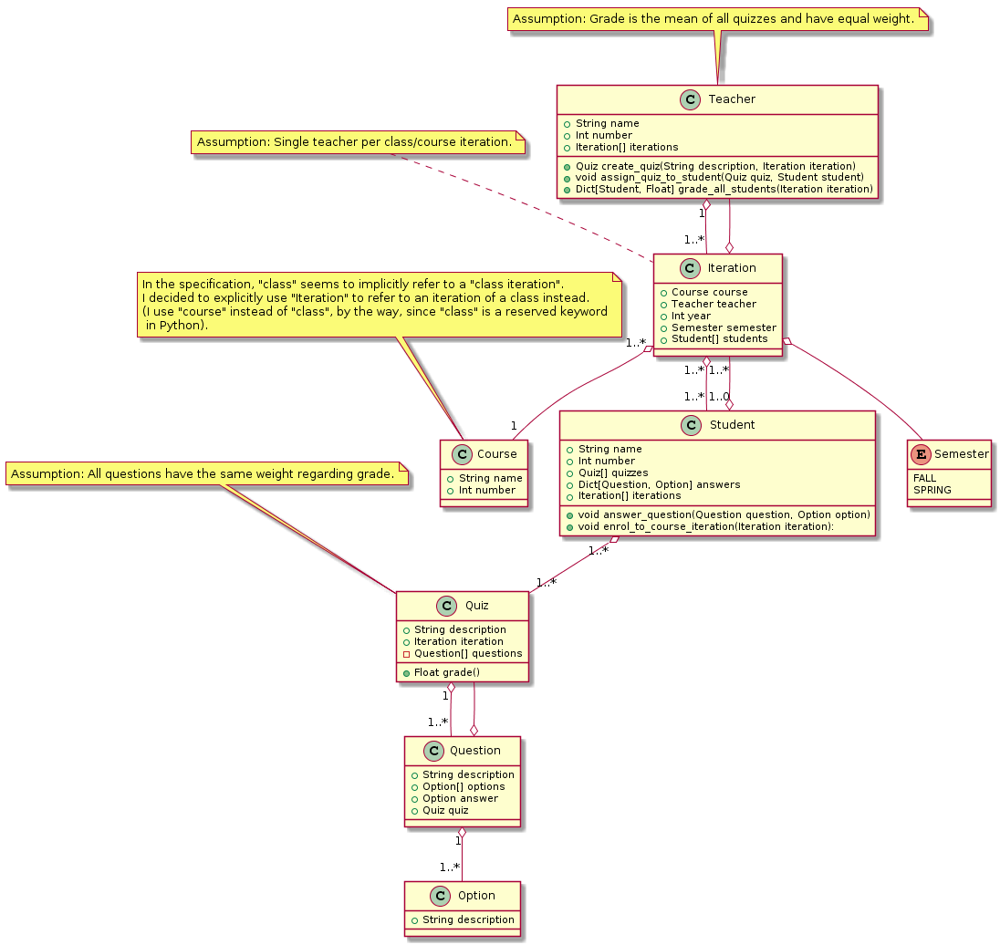

<!-- START doctoc generated TOC please keep comment here to allow auto update -->
<!-- DON'T EDIT THIS SECTION, INSTEAD RE-RUN doctoc TO UPDATE -->
**Table of Contents**

- [Student Quiz](#student-quiz)
  - [Overview](#overview)
  - [Design](#design)
  - [Running Tests](#running-tests)
  - [Running Gherkin Scenarios](#running-gherkin-scenarios)
  - [Coverage Reports](#coverage-reports)

<!-- END doctoc generated TOC please keep comment here to allow auto update -->

# Student Quiz

## Overview

Given the [requirements](./requirements), I believe that this was the perfect opportunity to do a [Kata](https://en.wikipedia.org/wiki/Kata_(programming)).

I also implemented runnable Gherkin scenarios using [Behave](https://behave.readthedocs.io/en/latest/), so it's possible to actually run the scenarios (refer to the `Running Gherkin Scenarios` section).

I have used [BDD](https://en.wikipedia.org/wiki/Behavior-driven_development) in the past (in Java, using [JBehave](https://jbehave.org/), in Javascript, using [Jasmine](https://jasmine.github.io/), and in Scala, using [FunSpec](http://www.scalatest.org/user_guide/tests_as_specifications)) and I thought that would be fun to do BDD in Python as well.

## Design

Given that I used test-drive development, the final object-oriented design is the result of iterating over and over back and forth between test and production code applying the `RED`->`GREEN`->`REFACTOR` cycle:

The diagram has a few notes regarding assumptions due to incomplete requirements. In short, I made the following assumptions:

- A class/course is taught by a single teacher.

- The semester's grade is the average of all grades with equal weight.

- All questions in a quiz have the same weight.

- A quiz grade is the fraction of questions the student answered correctly with all questions having equal weight.

I also made a distinction between "class" and "class iteration" (for each different year and semester) in the object-oriented design. For example:

"PHY-101" is a class, "PHY-101 offered in the spring of 2019" is an iteration.

I only completed enough code to fulfill the requirements, i.e.:

- Teacher creates quizzes.

- Teacher assigns quizzes to students.

- Quizzes are graded.

- Teacher grades students.

- Student answer to quizzes (which could be partially).

I used an additional requirement to make the project executable/testable though:

- Student enrols to class/course instance.

Note that I call a "class" a "course" in the actual code, given that "class" is a reserved keyword in the Python language.

## Running Tests

You may use your favorite Python unit test runner, I like [Nose](https://nose.readthedocs.io/en/latest/testing.html).

If you execute Nose in a terminal, as following:

    nosetests -vv

You should get an output similar to the following:

    nose.config: INFO: Ignoring files matching ['^\\.', '^_', '^setup\\.py$']
    test_add_questions_to_quiz (test.entities.test_quiz.TestQuiz) ... ok
    test_grade_quiz (test.entities.test_quiz.TestQuiz) ... ok
    test_student_answer_question (test.entities.test_student.TestStudent) ... ok
    test_create_quiz (test.entities.test_teacher.TestTeacher) ... ok
    test_teacher_assign_quiz_to_student (test.entities.test_teacher.TestTeacher) ... ok
    test_teacher_grade_students (test.entities.test_teacher.TestTeacher) ... ok

    ----------------------------------------------------------------------
    Ran 6 tests in 0.129s

    OK

Unit tests are available under the [tests folder](./test)

## Running Gherkin Scenarios

If you execute Behave in a terminal, as following:

    behave

You should get an output similar to the following:

    Feature: Student Behavior # features/student.feature:1

      Scenario: Student enrols to course iteration              # features/student.feature:3
        Given a student                                         # features/steps/all.py:18 0.000s
        And a course iteration                                  # features/steps/all.py:30 0.001s
        When the student enrol to the iteration                 # features/steps/all.py:54 0.000s
        Then iteration shows in the students list of iterations # features/steps/all.py:98 0.000s

      Scenario: Student answers a question                   # features/student.feature:10
        Given a student                                      # features/steps/all.py:18 0.000s
        And a question                                       # features/steps/all.py:36 0.000s
        When the student answers the question                # features/steps/all.py:59 0.000s
        Then an answer shows in the students list of answers # features/steps/all.py:103 0.000s

    Feature: Teacher Behavior # features/teacher.feature:1

      Scenario: Teacher creates a quiz                              # features/teacher.feature:3
        Given a teacher                                             # features/steps/all.py:24 0.000s
        And a course iteration                                      # features/steps/all.py:30 0.001s
        When the teacher creates a quiz                             # features/steps/all.py:64 0.000s
        Then the result quiz shows in the iteration list of quizzes # features/steps/all.py:118 0.000s

      Scenario: Teacher assigns quiz to student         # features/teacher.feature:10
        Given a teacher                                 # features/steps/all.py:24 0.001s
        And a student                                   # features/steps/all.py:18 0.000s
        And a quiz quiz1                                # features/steps/all.py:42 0.000s
        When the teacher assigns quiz1 to the student   # features/steps/all.py:70 0.000s
        Then quiz1 shows in the student list of quizzes # features/steps/all.py:123 0.000s

      Scenario: Teacher grades student that aced all quizzes  # features/teacher.feature:17
        Given a teacher                                       # features/steps/all.py:24 0.001s
        And a student                                         # features/steps/all.py:18 0.000s
        And a course iteration                                # features/steps/all.py:30 0.001s
        And a quiz quiz1                                      # features/steps/all.py:42 0.001s
        And a quiz quiz2                                      # features/steps/all.py:48 0.001s
        When the student enrol to the iteration               # features/steps/all.py:54 0.000s
        And the teacher assigns quiz1 to the student          # features/steps/all.py:70 0.000s
        And the teacher assigns quiz2 to the student          # features/steps/all.py:75 0.000s
        And the student aces quiz1                            # features/steps/all.py:80 0.000s
        And the student aces quiz2                            # features/steps/all.py:86 0.000s
        Then the student gets 1.0 grade                       # features/steps/all.py:133 0.000s

      Scenario: Teacher grades student that aced quiz1 but skipped quiz2  # features/teacher.feature:30
        Given a teacher                                                   # features/steps/all.py:24 0.000s
        And a student                                                     # features/steps/all.py:18 0.000s
        And a course iteration                                            # features/steps/all.py:30 0.000s
        And a quiz quiz1                                                  # features/steps/all.py:42 0.001s
        And a quiz quiz2                                                  # features/steps/all.py:48 0.000s
        When the student enrol to the iteration                           # features/steps/all.py:54 0.000s
        And the teacher assigns quiz1 to the student                      # features/steps/all.py:70 0.000s
        And the teacher assigns quiz2 to the student                      # features/steps/all.py:75 0.000s
        And the student aces quiz1                                        # features/steps/all.py:80 0.000s
        Then the student gets 0.5 grade                                   # features/steps/all.py:133 0.000s

      Scenario: Teacher grades student that completed correctly half of quiz1 and skipped quiz2  # features/teacher.feature:42
        Given a teacher                                                                          # features/steps/all.py:24 0.001s
        And a student                                                                            # features/steps/all.py:18 0.000s
        And a course iteration                                                                   # features/steps/all.py:30 0.001s
        And a quiz quiz1                                                                         # features/steps/all.py:42 0.001s
        And a quiz quiz2                                                                         # features/steps/all.py:48 0.001s
        When the student enrol to the iteration                                                  # features/steps/all.py:54 0.000s
        And the teacher assigns quiz1 to the student                                             # features/steps/all.py:70 0.000s
        And the teacher assigns quiz2 to the student                                             # features/steps/all.py:75 0.000s
        And the student gets right half of quiz1                                                 # features/steps/all.py:92 0.000s
        Then the student gets 0.25 grade                                                         # features/steps/all.py:133 0.000s

    2 features passed, 0 failed, 0 skipped
    7 scenarios passed, 0 failed, 0 skipped
    48 steps passed, 0 failed, 0 skipped, 0 undefined
    Took 0m0.017s

Gherkin scenarios are available under the [features folder](./features).

## Coverage Reports

If you have both Nose and [Coverage](https://coverage.readthedocs.io/en/v4.5.x/) in your development environment, you may generate coverage reports by executing Nose in a terminal as following:

    nosetests -vv --with-coverage --cover-inclusive --cover-html

You should get an output similar to the following:

    nose.config: INFO: Ignoring files matching ['^\\.', '^_', '^setup\\.py$']
    test_add_questions_to_quiz (test.entities.test_quiz.TestQuiz) ... ok
    test_grade_quiz (test.entities.test_quiz.TestQuiz) ... ok
    test_student_answer_question (test.entities.test_student.TestStudent) ... ok
    test_create_quiz (test.entities.test_teacher.TestTeacher) ... ok
    test_teacher_assign_quiz_to_student (test.entities.test_teacher.TestTeacher) ... ok
    test_teacher_grade_students (test.entities.test_teacher.TestTeacher) ... ok

    Name                              Stmts   Miss  Cover   Missing
    ---------------------------------------------------------------
    ctypes                              340    340     0%   3-552
    ...
    ...
    ...
     student_quiz                          0      0   100%
    student_quiz.entities                 0      0   100%
    student_quiz.entities.iteration      23      1    96%   38
    student_quiz.entities.option          9      1    89%   12
    student_quiz.entities.question       12      1    92%   21
    student_quiz.entities.quiz           22      1    95%   17
    student_quiz.entities.semester        4      0   100%
    student_quiz.entities.student        16      1    94%   10
    student_quiz.entities.teacher        24      1    96%   20
    ---------------------------------------------------------------
    TOTAL                             17803  17455     2%
    ----------------------------------------------------------------------
    Ran 6 tests in 0.074s

    OK

You will get coverage reports under the [cover folder](./cover). You may open the file `./cover/index.html` in your favorite browser after running the Nose command.
